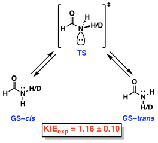

# Sample files
Included in this directory are a handful of files, output by [Gaussian 09](http://gaussian.com/), to be used as sample input for demonstrating Onyx's functionality.

The Onyx isotope effect functionality will be demonstrated using a secondary conformational kinetic isotope effect (KIE) for the C-N rotation in formamide reported by Perrin and co-workers in 1992(Figure 1).(REF) The reported *kH/kD* measured by NMR was 1.16 ± 0.10 at room temperature.

__Figure 1.__ Observed kinetic isotope effect for the C-N rotation in formamide.

## Log functionality
The `log_functionality` directory includes 4 log files and one text file necessary for the isotope effect computation:
- `Formamide_XXYY_Structure.log` is the output from a [Gaussian frequency computation](http://gaussian.com/freq/). `XX` simply identifies the computation as a ground state (`GS`) or transition state (`TS1`). `YY` identifies the isotopic labeling (`unlabeled` = hydrogen; `labeled` = deuterium). These are required for Onyx to parse frequency and thermochemistry information.
- `INPUT-logfunctionality.txt` is the input text file for the optional command-line functionality.

## Fchk functionality
The `fchk_functionality` directory includes 2 fchk files and one text file necessary for the isotope effect computation:
- `Formamide_XX_Structure.fchk` are formatted checkpoint files from [Guassian optimizations](http://gaussian.com/opt/). `XX` simply identifies the computation as a ground state (`GS`) or transition state (`TS1`). These are required for Onyx to run [`freqchk`](http://gaussian.com/freqchk/) to calculate frequency and thermochemical information.
- `INPUT-fchkfunctionality.txt` is the input text file for the optional command-line functionality.

## NMR
The `nmr` directory includes 5 files necessary for the shift difference computation:
- `1_hf6311_nmr.log` is the computed NMR output of the molecule. This is required to extract the computed proton shielding values.
- `1_hf6311_thermo_XX.log` files contain the computed thermochemical values for each deuterated molecule, from its respective log file. The numbers `XX` simply identify the position of the deuterium using the ID number assigned to each atom by Gaussian.
- `tms_hf6311+g2dp_nmr.log` is the computed NMR output of TMS standard.

## References
